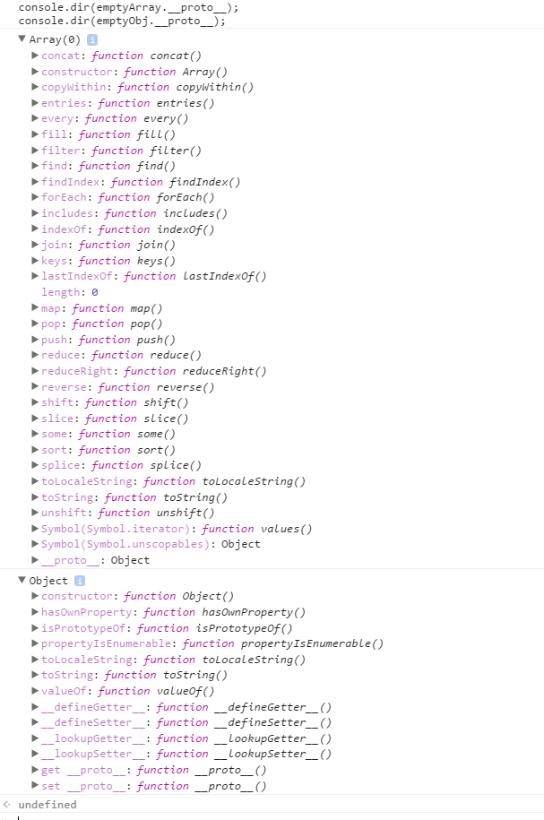
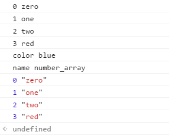

## 3.4 프로토타입
자바스크립트의 **모든 객체는 자신의 부모 역할을 하는 객체와 연결되어 있다.**  
그리고 이것은 마치 객체지향의 상속 개념과 같이 부모 객체의 프로퍼티를 마치 자신의 것처럼 쓸 수 있는 것 같은 특징이 있다.  

자바스크립트에서는 이러한 부모 객체를 **프로포타입 객체** 라고 부른다.
```js
var foo = {
    name : 'foo',
    age : 30
};

console.log(foo.toString());

console.dir(foo);
```


toString() 메서드가 없으므로 에러가 발생해야 하지만, 정상적으로 결과가 출력된 것을 확인할 수 있다.  
그 이유는 **foo 객체의 프로토타입** 에 toString() 메서드가 이미 정의되어 있고, foo 객체가 상속처럼 toString() 메서드를 호출했기 때문이다.  

foo 객체의 `__proto__` 프로퍼티가 가리키는 객체가 바로 Object.prototype 이며, toString(), valueOf() 등과 같은 모든 객체에서 호출 가능한 자바스크립트 기본 내장 메서드가 포함되어 있다.  
그 결과 foo.toStrig() 과 같이 자신의 프로토타입인 Object.prototype 객체에 포함된 다양한 메서드를 마치 자신의 프로퍼티인 것처럼 상속받아 사용할 수있다.  
또한, 객체를 생성할 때 결정된 프로토타입 객체는 임의의 다른 객체로 변경하는 것도 가능하다.  
즉, **부모 객체를 동적으로 바꿀 수도 있는 것** 이다.  
자바스크립트에서는 이러한 특징을 활용해서 객체 상속 등의 기능을 구현한다.

## 3.5 배열
배열은 자바스크립트 객체의 특별한 형태다.  
즉, C나 자바의 배열과 같은 기능을 하는 객체지만, 이들과는 다르게 굳이 크기를 지정하지 않아도 되며, 어떤 위치에 어느 타입의 데이터를 저장하더라도 에러가 발생하지 않는다.

### 3.5.1 배열 리터럴
**배열 리터럴** 은 자바스크립트에서 새로운 배열을 만드는 데 사용하는 표기법이다.  
객체 리터럴이 중괄호({})를 이용한 표기법이었다면, 배열 리터럴은 **대괄호([])** 를 사용한다.  
```js
//배열 리터럴을 통한 5개 원소를 가진 배열 생성
var colorArr = ['orange', 'yellow', 'blue', 'green', 'red'];
console.log(colorArr[0]);   // (출력값 orange)
console.log(colorArr[1]);   // (출력값 yellow)
console.log(colorArr[4]);   // (출력값 red)
```
객체 리터럴에서는 프로퍼티 이름과 프로퍼티값을 모두 표기해야 하지만,  
배열 리터럴에서는 **각 요소의 값** 만을 포함한다.  
객체가 **프로퍼티의 이름** 으로 대괄호나 마침표 표기법을 이용해 해당 프로퍼티에 접근했다면, 배열의 경우는 앞 예제처럼 대괄호 내에 접근하고자 하는 원소에 **배열 내 위치 인덱스값** 을 넣어서 접근한다.  
배열 내의 첫 번째 원소는 인덱스 0부터 시작한다.

### 3.5.2 배열의 요소 생성
객체가 동적으로 프로퍼티를 추가할 수 있듯이, 배열도 동적으로 배열 원소를 추가할 수 잇다.  
특히, 자바스크립트 배열의 경우는 값을 순차적으로 넣을 필요 없이 아무 인덱스 위치에나 값을 동적으로 추가할 수 있다.  
```js
//배열 원소 동적 생성
var emptyArr = [];
console.log(emptyArr[0]);   // (출력값 undefined);

emptyArr[0] = 100;  // (출력값 [100])
emptyArr[3] = 'eight' // (출력값 [100, undefined, undefined, 'eight'])
console.log(emptyArr.length);   //(출력값 4)
```
값이 할당되지 않은 인덱스의 요소는 undefined 값을 기본으로 가진다.  
**모든 배열은 length 프로퍼티가 있다.**  

### 3.5.3 배열의 length 프로퍼티
length 프로퍼티는 배열의 원소 개수를 나타내지만, 실제로 배열에 존재하는 원소 개수와 일치하는 것은 아니다.  
즉, length 프로퍼티는 **배열 내에 가장 큰 인덱스에 1을 더한 값이다.**  
때문에 배열의 가장 큰 인덱스값이 변하면, length 값 또한 자동으로 그에 맞춰 변경된다.
```js
var arr = [];
console.log(arr.length);    // (출력값 0)

arr[0] = 0;
arr[100] = 100;
console.log(arr.length);    // (출력값 101)
```
배열의 인덱스 100 위치에 값을 저장한 순간, 가장 큰 인덱스값인 100을 기준으로 해서 배열의 length 값이 101로 늘어난다.  
하지만 실제 메모리는 length 크기처럼 할당되지는 않는다.  

배열의 length 프로퍼티는 코드를 통해 명시적으로 값을 변경할 수도 있다.

```js
var arr = [0, 1, 2];
console.log(arr.length);    // (출력값 3)

arr.length = 5;
console.log(arr);   // (출력값 [0, 1, 2, undefined, undefined])

arr.length = 2;
console.log(arr);   // (출력값 [0, 1])
console.log(arr[2]);    // (출력값 undefined)
```
length 프로퍼티를 벗어나는 실제 값은 삭제된다.

#### 3.5.3.1. 배열 표준 메서드와 length 프로퍼티
자바스크립트는 배열에서 사용 가능한 다양한 표준 메서드를 제공한다.  
이러한 배열 메서드는 **length 프로퍼티** 를 기반으로 동작한다.
```js
//arr 배열 생성
var arr = ['zero', 'one', 'two'];

//push() 메서드 호출
arr.push('three');
console.log(arr);   // (출력값 ['zero', 'one', 'two', 'three'])

//length 값 변경 후, push() 메서드 호출
arr.length = 5;
arr.push('four');
console.log(arr);   // (출력값 ['zero', 'one', 'two', 'three', undefined, 'four'])
```
arr.length 프로퍼티값을 임의로 5로 바꾸면 push() 메서드는 현재 변경된 arr.length 가 가리키는 배열의 5번째 인덱스, arr[5]에 'four' 문자열을 추가하기 된다.  
이렇듯 배열의 length 프로퍼티는 배열 메서드에 동작에 영약을 줄 수 있을 만큼 배열에서는 중요한 프로퍼티이다.

### 3.5.4 배열과 객체
자바스크립트에서는 배열 역시 객체다.  
하지만 배열은 일반 객체와는 약간 차이가 있다.  
우선 객체는 length 프로퍼티가 존재하지 않는다. 때문에 객체의 length는 undefined가 나온다.  

배열과 객체의 또 하나의 차이점은 객체는 배열이 아니므로 push()와 같은 **표준 배열 메서드** 를 사용할 수 없다.  

반면 배열의 경우 Array.prototype 객체가 부로 객체인 프로포터입이 된다.  
Array.prototype 객체는 배열에서 사용할 push(), pop() 같은 표준 메서드를 포함하고 있다.  
그리고 Array.prototype 객체의 프로토타입은 Object.prototype 객체가 된다.

```js
var emptyArray = [];
var emptyObj = {};

console.dir(emptyArray.__proto__);
console.dir(emptyObj.__proto__);
```


### 3.5.5 배열의 프로퍼티 동적 생성
배열도 자바스크립트 객체이므로, 인덱스가 숫자인 배열 원소 이외에도 객체처럼 동적으로 프로퍼티를 추가할 수있다.
```js
//배열 생성
var arr = ['zero', 'one', 'two'];
console.log(arr.length);    // (출력값 3)

//프로퍼티 동적 구가
arr.color = 'blue';
arr.name = 'number_array';
console.log(arr.length);    // (출력값 3)

//배열 원소 추가
arr[3] = 'red';
console.log(arr.length);    // (출력값 4)

//배열 객체 출력
console.dir(arr);
```
위 예제에서는 arr 배열에 동적으로 color와 name 프로퍼티를 추가햇다.  
하지만, 배열에 동적 프로퍼티가 추가될 경우는 배열의 length 값이 3으로 바뀌지 않는다는 것이다.  
즉, 배열의 length 프로퍼티는 배열 원소의 가장 큰 인덱스가 변했을 경우만 변경된다.


### 3.5.6 배열의 프로퍼티 열거
객체는 for in 문으로 프로퍼티를 열거한다.  
배열도 객체이므로 for in 문을 사용해서 배열 내의 모든 프로퍼티를 열거 할 수 잇지만, 이렇게 되면 불필요한 프로퍼티가 출력될 수 있으므로 되도록 for 문을 사용하는 것이 좋다.
```js
//배열의 프로퍼티 열거
for ( var prop in arr ) {
    console.log(prop, arr[prop]);
}

for ( var i = 0 ; i < arr.length ; i++ ) {
    console.log(i, arr[i]);
}
```


### 3.5.7 배열 요소 삭제
배열도 객체이므로, 배열 요소나 프로퍼티를 삭제하는데 `delete`연산자를 사용할 수 있다.
```js
//delete 연산자를 이용한 배열 프로퍼티 삭제
var arr = ['zero', 'one', 'two', 'three'];
delete arr[2];
console.log(arr);   // (출력값 ["zero", "one", undefined × 1, "three"])
```
위 예제에서 `delete`연산자로 배열의 요소를 삭제하면, arr[2]에 undefined가 할당되게 된다.  
그러나 delete 연산자로 배열 요소 삭제 후에도 배열의 length 값은 변하지 않은 것을 확인할 수 있다.  
즉, delete 연산자는 해당 요소의 값을 undefined로 설정할 뿐 원소 자체를 삭제하지는 않는다.  
때문에 보통 배열에서 요소들을 완전히 삭제할 경우 자바스크립트에서는 **splice() 배열 메서드** 를 사용한다.  

>splice() 메서드
splice(start, deleteCount, item...)  

- start - 배열에서 시작 위치
- deleteCount - start에서 지정한 시작 위치부터 삭제할 요소의 수
- item - 삭제할 위치에서 추가할 요소
```js
var arr = ['zero', 'one', 'two', 'three'];

arr.splice(2, 1);   // 2번째 요소를 시작점으로 1개의 원소를 삭제한다.
console.log(arr);   // (출력값 ['zero', 'one', 'three'])
console.log(arr.length);    // (출력값 3)
```

### 3.5.8 Array() 생성자 함수
배열은 일반적으로 배열 리터럴로 생성하지만, 배열 리터럴도 결국 자바스크립트 기본 제공 **Array() 생성자 함수** 로 배열을 생성하는 과정을 단순화 시킨 것이다.  

Array() 생성자 함수는 호출할 때 인자 개수에 따라 동작이 다르므로 주의해야 한다.
- 호출할 때 인자가 1개이고, 숫자일 경우 : 호출된 인자를 length로 갖는 빈 배열 생성
- 그외의 경우 : 호출된 인자를 요소로 갖는 배열 생성
```js
var foo = new Array(3);
console.log(foo);   // (출력값 [undefined, undefined, undefined])
console.log(foo.length);    //(출력값 3)

var bar = new Array(1, 2, 3);
console.log(bar);   // (출력값 [1, 2, 3])
console.log(bar.length);    // (출력값 3)
```

### 3.5.9 유사 배열 객체
배열의 length 프로퍼티는 배열의 동작에 있어서 중요한 프로퍼티이다.  
자바스크립트에서는 length 프로퍼티를 가진 객체를 **유사 배열 객체** 라고 부른다.  
이러한 유사 배열 객체의 가장 큰 특징은 객체임에도 불구하고, 자바스크립트의 표준 배열 메서드를 사용하는게 가능하다는 것이다.
```js
//유사 배열 객체에서 apply()를 활용한 배열 메서드 호출
var arr = ['bar'];
var obj = {
    name : 'foo',
    length : 1
};

arr.push('barz');
console.log(arr);   // (출력값 ['bar', 'barz'])

Array.prototype.push.apply(obj, ['barz']);
console.log(obj);   // (출력값 {1: "barz", name: "foo", length: 2})
```
