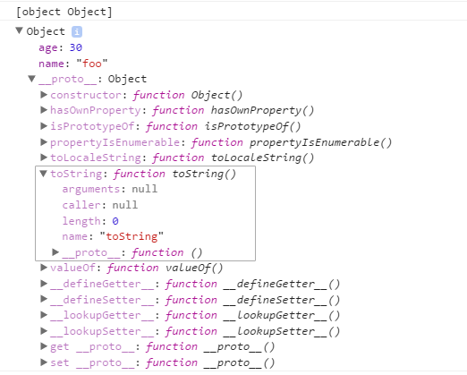

## 3.4 프로토타입
자바스크립트의 **모든 객체는 자신의 부모 역할을 하는 객체와 연결되어 있다.**  
그리고 이것은 마치 객체지향의 상속 개념과 같이 부모 객체의 프로퍼티를 마치 자신의 것처럼 쓸 수 있는 것 같은 특징이 있다.  

자바스크립트에서는 이러한 부모 객체를 **프로포타입 객체** 라고 부른다.
```js
var foo = {
    name : 'foo',
    age : 30
};

console.log(foo.toString());

console.dir(foo);
```



toString() 메서드가 없으므로 에러가 발생해야 하지만, 정상적으로 결과가 출력된 것을 확인할 수 있다.  
그 이유는 **foo 객체의 프로토타입** 에 toString() 메서드가 이미 정의되어 있고, foo 객체가 상속처럼 toString() 메서드를 호출했기 때문이다.
