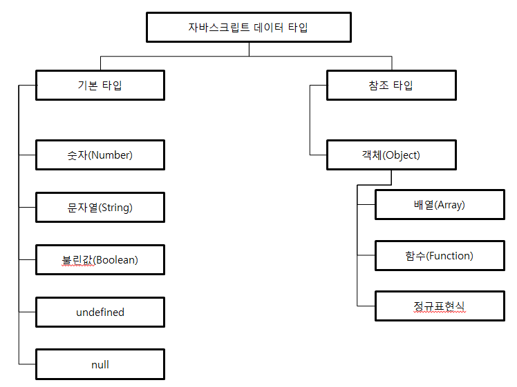

# 03 자바스크립트 테이터 타입과 연산자
모든 언어의 기본은 데이터 타입을 파악하는 것에서부터 시작한다.  
자바스크립트의 값들은 크게 `기본타입`과 `참조타입`으로 나뉜다.

## 3.1 자바스크립트의 기본 타입
>자바스크립트의 기본타입
- 숫자
- 문자열
- 불린값(true, fasle)
- null
- undefined  

이들 타입의 특징은 <strong>그 자체가 하나의 값</strong>을 나타낸다.  

자바스크립트는 <strong>느슨한 타입 체크 언어</strong>다.  
자바스크립트는 변수를 선언할 때 타입을 미리 정하지 않고, `var`라는 한 가지 키워드로만 변수를 선언한다.  
이렇게 선언된 변수에는 어떤 타입의 데이터라도 저장하는 것이 가능하다.  
